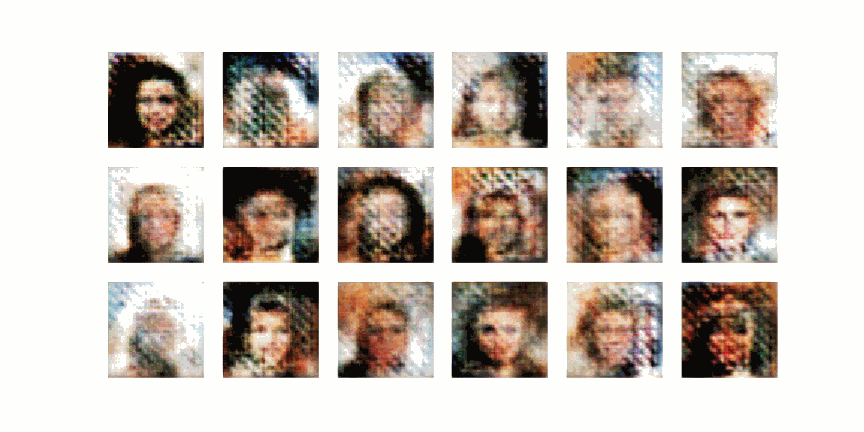
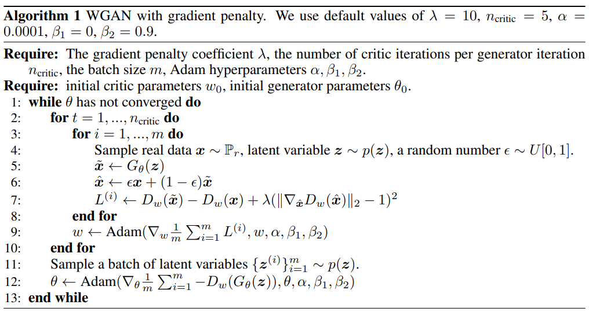
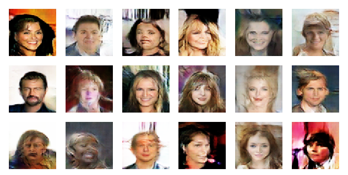
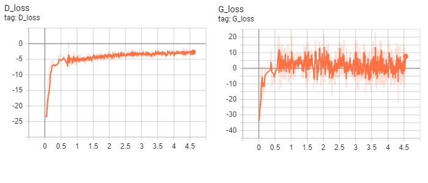

# WGAN-GP Tensorflow 2.0

This repo is the TF2.0 implementation of [Improved Training of Wasserstein GANs](https://arxiv.org/abs/1704.00028). 

Note that this implementation is not totally the same as the paper. There might be some differences.



## Algorithm


This image is from the original paper. The code below is functions of single training step.

```
@tf.function
def WGAN_GP_train_d_step(real_image, batch_size, step):
    noise = tf.random.normal([batch_size, NOISE_DIM])
    epsilon = tf.random.uniform(shape=[batch_size, 1, 1, 1], minval=0, maxval=1)
    ###################################
    # Train D
    ###################################
    with tf.GradientTape(persistent=True) as d_tape:
        with tf.GradientTape() as gp_tape:
            fake_image = generator([noise], training=True)
            fake_image_mixed = epsilon * tf.dtypes.cast(real_image, tf.float32) + ((1 - epsilon) * fake_image)
            fake_mixed_pred = discriminator([fake_image_mixed], training=True)
            
        # Compute gradient penalty
        grads = gp_tape.gradient(fake_mixed_pred, fake_image_mixed)
        grad_norms = tf.sqrt(tf.reduce_sum(tf.square(grads), axis=[1, 2, 3]))
        gradient_penalty = tf.reduce_mean(tf.square(grad_norms - 1))
        
        fake_pred = discriminator([fake_image], training=True)
        real_pred = discriminator([real_image], training=True)
        
        D_loss = tf.reduce_mean(fake_pred) - tf.reduce_mean(real_pred) + LAMBDA * gradient_penalty
    # Calculate the gradients for discriminator
    D_gradients = d_tape.gradient(D_loss,
                                            discriminator.trainable_variables)
    # Apply the gradients to the optimizer
    D_optimizer.apply_gradients(zip(D_gradients,
                                                discriminator.trainable_variables))

@tf.function
def WGAN_GP_train_g_step(real_image, batch_size, step):
    noise = tf.random.normal([batch_size, NOISE_DIM])
    ###################################
    # Train G
    ###################################
    with tf.GradientTape() as g_tape:
        fake_image = generator([noise], training=True)
        fake_pred = discriminator([fake_image], training=True)
        G_loss = -tf.reduce_mean(fake_pred)
    # Calculate the gradients for generator
    G_gradients = g_tape.gradient(G_loss,
                                            generator.trainable_variables)
    # Apply the gradients to the optimizer
    G_optimizer.apply_gradients(zip(G_gradients,
                                                generator.trainable_variables))

```

## Dataset

The notebook trains WGAN-GP using aligned [CelebA](http://mmlab.ie.cuhk.edu.hk/projects/CelebA.html) dataset, the image resolution is adjusted to 64*64. Due to the limitation of computation resource, I train the models for only 40 epochs. It may be able to produce better images if trained for more epochs. 

## Environments

* Python 3
* jupyter or jupyterlab
* numpy
* matplotlib
* tensorflow 2.0

## How to Run

There are two ways to run this repo.

*   1. Download the dataset you want.

    2. Clone this repo, then use Juypter Notebook or Lab to open the `WGAN-GP-celeb64.ipynb`     file, and modify the dataset path in the **Prepare dataset** section.

* Run in Google Colab [:smiley_cat:](https://colab.research.google.com/drive/12nvXHacUtAsaoh3uN9uK-QXXIP_JD7uh)

(In the default setting, training one epoch would take about 300~500 seconds.)

## Results

Result at 40 epoch



Training losses (Did not multiply negative)



## Acknowledges

Ishaan Gulrajani, Faruk Ahmed, Martin Arjovsky, Vincent Dumoulin, and Aaron Courville, "Improved Training of Wasserstein GANs", https://arxiv.org/abs/1704.00028

Alec Radford, Luke Metz, Soumith Chintala, "Unsupervised Representation Learning with Deep Convolutional Generative Adversarial Networks", https://arxiv.org/abs/1511.06434

TKarras's PGGAN repository, https://github.com/tkarras/progressive_growing_of_gans